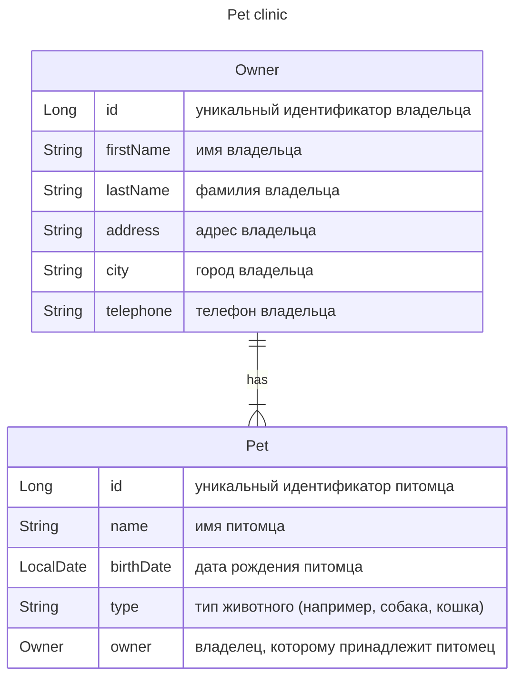

### Описание проекта

Описание проекта
Разработать систему управления для ветеринарной
клиники. Система должна включать две основные
сущности: Владелец (Owner) и Питомец (Pet). Каждый
владелец может иметь множество питомцев, а каждый
питомец принадлежит только одному владельцу.




### Зависимости проекта
- `org.springframework.boot:spring-boot-starter-data-jpa`
- `org.springframework.boot:spring-boot-starter-jdbc`
- `org.springframework.boot:spring-boot-starter-validation`
- `org.springframework.boot:spring-boot-starter-web`
 - Runtime:
   - `com.h2database:h2`
   - ` org.postgresql:postgresql`
 - Compile:
   - `org.springframework.boot:spring-boot-configuration-processor`     
   - `org.projectlombok:lombok`
 - Test:
   - `org.springframework.boot:spring-boot-starter-test`

### Запуск
```shell

```

